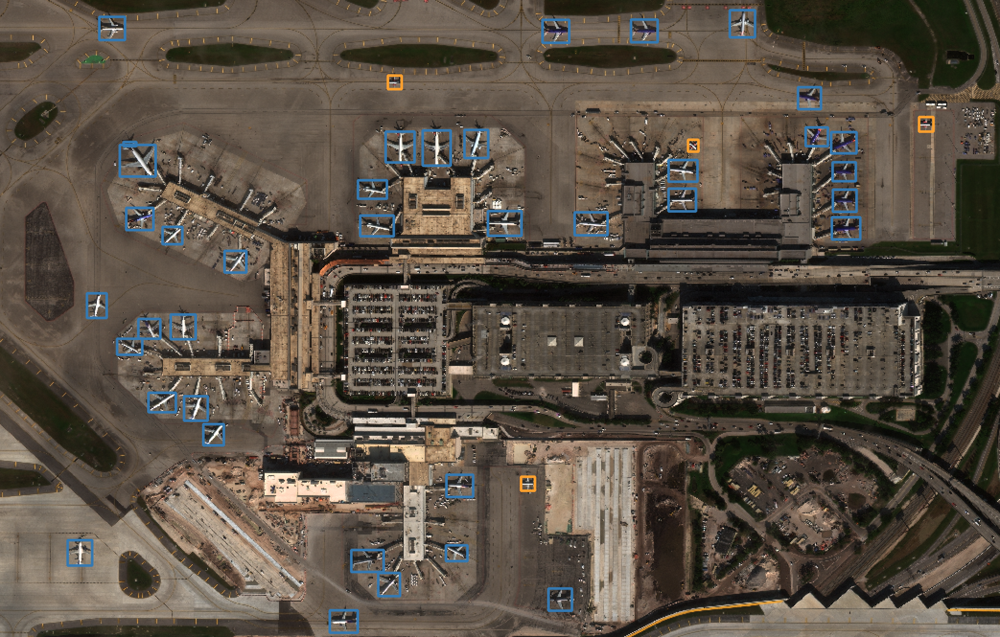

# YOLOv5 Object Detection for RarePlanes Tutorial

This repo contains four notebook tutorials in which you create a custom class using the RarePlanes data set, train a YOLOv5 model, perform inferences on the test set, and then evaluate performace. 

## How to use this repo: 

You can either access the tutorial pipeline hosted on AWS by accessing the AMI [here](https://console.aws.amazon.com/ec2) or reproduce the enviornment using your own GPUs by cloning this repository

### A. AMI/EC2

For the AMI, all the relevant data and packages have been downloaded so you should easily be able to spin up and follow along with the tutorial. For more informaion on how to spin up an AMI, please visit the first half of this [blog](https://medium.com/the-downlinq/deploying-the-spacenet-6-baseline-on-aws-c811ad82da1)

1. Spin up the AMI instance from [here](https://console.aws.amazon.com/ec2)
2. Ensure you are in the `N. Virginia` and then hit `Launch Instance` 
3. Search for the pre-built AMI titled `CosmiQ_YOLO_Planes`
4. Select the `p3.2xlarge` instance type and hit the `Review and Launch`, `Launch` buttons succesively
5. Create a new key pair and download and launch this key pair
6. SSH into the machine using your address. The command should look like this `ssh -i "cosmiq-yolo-planes-aws.pem" ubuntu@ec2-3-236-98-0.compute-1.amazonaws.com`
7. Navigate to the directory `/home/ubuntu/src/yolo_planes/yolov5/`
8. Launch the jupyter lab using `jupyter lab --ip=0.0.0.0`
9. Open a browser and insert the EC2 ip into the address bar; it should look like this `ec2-3-235-146-223.compute-1.amazonaws.com:8888`
10. The password for the jupyter lab is `yoloplanes`
11. Open the notebook titled `1_yolo_start.ipynb`

### B. On your own GPUs 

1. Clone this repository 
2. Download the data from [here](https://www.cosmiqworks.org/rareplanes/). You will only need the real data for this tutorial 
3. You will need to sort the images from the PS-RGB_tiled directory per yolo specifications with the following hiearchy:
```
class_one (or any other name) 
|--images (these are the downloaded tiled .pngs) 
|     |--train 
|     |--val
|--labels (you will create these during the tutorial)
|     |--train
|     |--val
```
4. Create your docker image using the command `nvidia-docker build -t <name_of_image> ./`
5. Your container should now appear in `docker container ls -l`
6. Then run `NV_GPU=0,1 nvidia-docker run -it -v /dir/to/yolov5:/yolov5/ -p 9002:9002 --shm-size=64g --name <name_of_container> <name_of_image>`
7. Navigate to the directory `yolov5` directory on your GPU
8. Launch conda enviornment using `conda activate solaris`
9. Launch the jupyter notebook using `jupyter notebook --ip 0.0.0.0 --no-browser --allow-root --port=9002`
10. Open a browser and insert your ip into the address bar; it should look like this `http://gpu02:9002/`   Use the token supplied in the terminal as your password.
11. Open the notebook titled `1_yolo_start.ipynb`

This ML pipeline uses a modified implementation of the YOLOv5 implementation found [here](https://github.com/ultralytics/yolov5). The full RarePlanes dataset can be found [here](https://www.cosmiqworks.org/rareplanes/) and helper functions for the dataset can be found [here](https://github.com/aireveries/RarePlanes). 

If you have any questions or errors, please don't hesitate to post an issue or email me [here](ari.chadda@gmail.com). 

